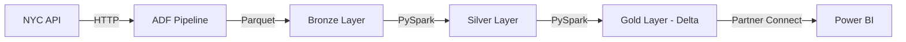

# 🚀 End-to-End NYC Taxi Data Engineering Project

## 🎯 Project Overview

- A comprehensive real-time data engineering solution that demonstrates **end-to-end automation** of data pipelines using modern cloud technologies.
- This project processes NYC Green Taxi Trip Records (2024) using the **Medallion Architecture** (Bronze-Silver-Gold) pattern, showcasing industry-standard practices for data ingestion, transformation, and analytics.

### Why This Project Stands Out
- ✅ **Real-time API ingestion** instead of manual uploads
- ✅ **Dynamic, parameterized pipelines** for scalability
- ✅ **Production-grade file formats** (Parquet, Delta Lake)
- ✅ **Enterprise security** with Managed Identities
- ✅ **Advanced Delta Lake features** (ACID, Time Travel, Versioning)
- ✅ **Complete data delivery** to business intelligence tools

## 🏗️ Architecture


## 💻 Technologies Used

| Category | Technology | Purpose |
|----------|-----------|---------|
| **Cloud Platform** | Microsoft Azure | Infrastructure and services |
| **Data Orchestration** | Azure Data Factory | Pipeline automation and scheduling |
| **Data Storage** | Azure Data Lake Gen2 | Hierarchical data lake storage |
| **Data Processing** | Databricks + PySpark | Distributed data transformation |
| **Data Format** | Parquet, Delta Lake | Columnar storage with ACID properties |
| **Security** | Managed Identity | Secure authentication |
| **Analytics** | Power BI | Business intelligence and reporting |

## 🌟 Key Features

### 1. **Real-Time API Data Ingestion**
- Direct data extraction from NYC Open Data API
- No manual downloads or uploads
- HTTP linked service with dynamic relative URLs

### 2. **Dynamic Pipeline Architecture**
```yaml
Features:
  - Parameterized datasets
  - ForEach loop activities
  - Error handling and retry logic
  - Scalable for multiple data sources
```

### 3. **Medallion Architecture Implementation**
- **Bronze Layer**: Raw, unprocessed data from API
- **Silver Layer**: Cleaned, validated, and structured data
- **Gold Layer**: Business-ready aggregated data with Delta tables

### 4. **Advanced Delta Lake Features**
- ✅ ACID transactions for data reliability
- ✅ Time Travel for historical data queries
- ✅ Schema evolution and enforcement
- ✅ Data versioning with Delta Log
- ✅ Efficient CRUD operations (UPDATE, DELETE, MERGE)

### 5. **Security Best Practices**
- System-assigned Managed Identity for passwordless authentication
- Role-based access control (RBAC)
- Secure data access between services


## 🔧 Implementation Details

### Phase 1: Data Ingestion (Bronze Layer)

**Objective**: Automate data extraction from NYC Taxi API

**Components**:
1. **HTTP Linked Service**: Connection to NYC Open Data portal
2. **Source Dataset**: Dynamic Parquet file specification
3. **Sink Dataset**: Azure Data Lake Gen2 bronze container
4. **Copy Activity**: Data movement from API to storage

**Code Snippet - Dynamic Pipeline Parameter**:
```python
@pipeline().parameters.filename
# Example: yellow_tripdata_2023-01.parquet
```

### Phase 2: Data Transformation (Silver Layer)

**Objective**: Clean and structure raw data

**PySpark Transformations**:
```python
from pyspark.sql.functions import *
from pyspark.sql.types import *

# Read CSV with schema inference
df_trip_type = spark.read.format("csv") \
    .option("inferSchema", True) \
    .option("header", True) \
    .load("abfss://bronze@storage.dfs.core.windows.net/trip_type")

# Read Parquet recursively
df_trip_data = spark.read.format("parquet") \
    .option("recursiveFileLookup", True) \
    .load("abfss://bronze@storage.dfs.core.windows.net/trips_2023")
```

### Phase 3: Data Modeling (Gold Layer)

**Objective**: Create business-ready Delta tables

**Delta Table Creation**:
```python
# Create database
spark.sql("CREATE DATABASE IF NOT EXISTS gold")

# Write Delta table
df_cleaned.write \
    .format("delta") \
    .mode("overwrite") \
    .saveAsTable("gold.trip_zone")
```

**Delta Lake Operations**:
```sql
-- View table history
DESCRIBE HISTORY gold.trip_zone;

-- Time travel to previous version
SELECT * FROM gold.trip_zone VERSION AS OF 0;

-- Restore table to previous state
RESTORE TABLE gold.trip_zone TO VERSION AS OF 0;

-- Update records
UPDATE gold.trip_zone 
SET boro = 'EWR' 
WHERE location_id = 1;

-- Delete records
DELETE FROM gold.trip_zone 
WHERE location_id = 1;
```

### Phase 4: Data Delivery (Power BI)

**Connection Method**:
1. Navigate to Databricks → Partner Connect
2. Select Power BI → Download .pbix connection file
3. Authenticate using Databricks Access Token
4. Load Delta tables into Power BI Desktop
5. Build dashboards and reports

## 📊 Data Flow



**Detailed Flow**:
1. **Ingestion**: ADF pulls monthly Parquet files from NYC API
2. **Raw Storage**: Files stored in Bronze layer (Data Lake)
3. **Transformation**: Databricks reads Bronze, applies cleaning logic
4. **Cleaned Storage**: Transformed data saved to Silver layer
5. **Aggregation**: Business logic applied, Delta tables created in Gold
6. **Consumption**: Power BI connects to Gold layer for reporting

## 📚 Learning Outcomes

### Technical Skills Demonstrated

✅ **Cloud Architecture**: Designed scalable data pipelines on Azure  
✅ **ETL/ELT Processes**: Built dynamic extraction and transformation workflows  
✅ **Big Data Processing**: Used PySpark for distributed computing  
✅ **Data Lake Implementation**: Implemented medallion architecture  
✅ **Delta Lake Mastery**: Applied ACID transactions and time travel  
✅ **Security**: Implemented managed identities for authentication  
✅ **Data Visualization**: Connected processed data to BI tools  

## Snaps

-

-

- 

- 

-


## 🤝 Contributing

Contributions, issues, and feature requests are welcome!

## 👤 Author

**Your Name**
- GitHub: [Anubhav Kumar Gupta](https://github.com/AnubhavKumarGupta)
- LinkedIn: [Anubhav Kumar Gupta(https://www.linkedin.com/in/anubhav2109/)

---

⭐ If you found this project helpful, please consider giving it a star!

**Project Status**: ✅ Completed | 📅 Last Updated: December 2025
